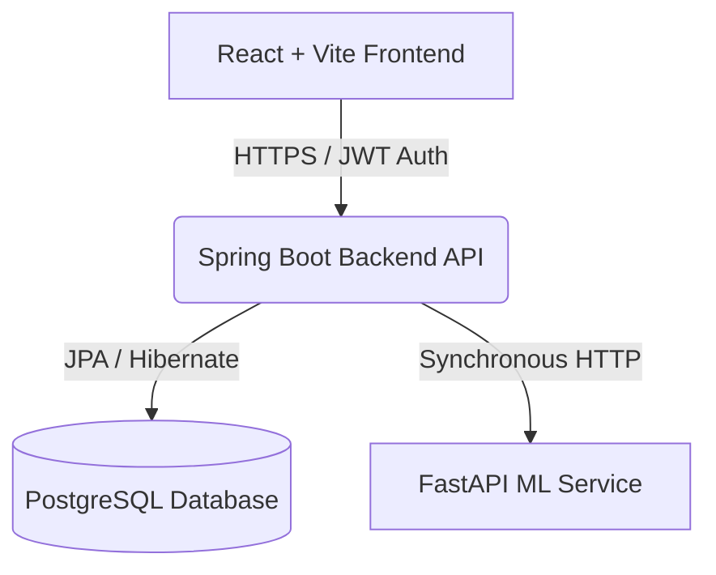

<div align="center">
  
  <h1>LuminaHealth AI Platform</h1>
  <p><strong>A Production-Ready AI Health Monitoring SaaS Platform</strong></p>
  
  [](https://luminahealth.up.railway.app)
  [](https://www.docker.com/)
  [](https://spring.io/)
  [](https://reactjs.org/)
  [](https://fastapi.tiangolo.com/)

</div>

<br>

> 🚀 **Note:** This is a comprehensive portfolio project demonstrating full-stack engineering, microservices architecture, machine learning integration, Docker containerization, and cloud deployment.

## 🌟 Live Demonstration
The platform is deployed live as a unified architecture on Railway.
- **Live Demo Site:** [https://luminahealth.up.railway.app](https://luminahealth.up.railway.app)

---

## 🏗️ System Architecture

LuminaHealth utilizes a decoupled containerized microservice architecture:



### Components
1. **Frontend (React + Vite + Tailwind CSS):** A responsive, glassmorphism-styled dashboard containing real-time visual charts (Recharts) and an AI intelligence panel.
2. **Backend (Spring Boot 3 + Java 17):** Primary orchestrator handling JWT Authentication, CORS, API load balancing, and persisting health records.
3. **ML Service (FastAPI + Python):** Dedicated mathematical microservice computing Health Risk levels using Deep Learning proxies.
4. **Database (PostgreSQL 15):** Relational persistence layer.

---

## ✨ Features

* **Real-time Analytics Dashboard**: The React application silently polls for live vitals every 30 seconds to refresh the UI dynamically.
* **AI Risk Gauges**: Mathematically calculates absolute risk levels, rendered into a stunning Consumer Health Score and gauge.
* **Smart Alerting Engine**: A customized algorithm parses raw user vitals and alerts the user if clinical thresholds (e.g. Glucose > 160) are breached.
* **Global Error Interceptors**: The Axios network layer safely catches 5xx crashes and network timeouts, injecting graphical fallback messages rendering the UI indestructible.
* **Secure JWT Auth**: Stateless session management with HTTP interceptors auto-appending Bearer tokens to all outbound requests.
* **Dockerized Microservices**: Orchestrated entirely via `docker-compose` for rapid 1-click bootup across all operating systems.

---

## 🐳 Docker Deployment (Local)

The entire application (Database, Backend, ML, Frontend) can be spun up in a single command using Docker.

### Prerequisites
- Docker & Docker Compose installed

### Run the Stack
```bash
docker-compose up --build
```

The services will be available at:
- **Frontend App**: `http://localhost:5173`
- **Backend API**: `http://localhost:8080/api`
- **ML Service**: `http://localhost:8000/docs`

---

## ☁️ Cloud Deployment (Railway)

This repository is optimized for a 1-click unified deployment on [Railway](https://railway.app).

### Deployment Instructions
1. **Connect GitHub Account:** Log into Railway and connect this GitHub repository.
2. **Setup from Repo:** Select "Deploy from GitHub repo".
3. **Docker Compose Detection:** Railway will automatically detect the `docker-compose.yml` file and provision 4 distinct services (postgres, ml, backend, frontend) into a private network environment.
4. **Environment Variables:** Railway will automatically mount the environment variables specified in the compose file. You can override `JWT_SECRET` in the Railway dashboard for enhanced security.
5. **Assign Public Domain:**
   - Go to the `frontend` service settings in Railway.
   - Click **Generate Domain**.
   - Your React app is now publicly accessible at `https://your-app-name.up.railway.app`!
   - Navigate to the frontend's variables, and set `VITE_API_BASE_URL` to your Railway Backend public domain (you must generate a domain for the backend too), then trigger a frontend re-deploy to bake the domain into the Vite bundle.

---

## 💻 Manual Setup

If you prefer not to use Docker, see the individual microservice directories:
- `health-monitoring-frontend/README.md`
- `health-monitoring-backend/README.md`
- `ml-service/README.md`
