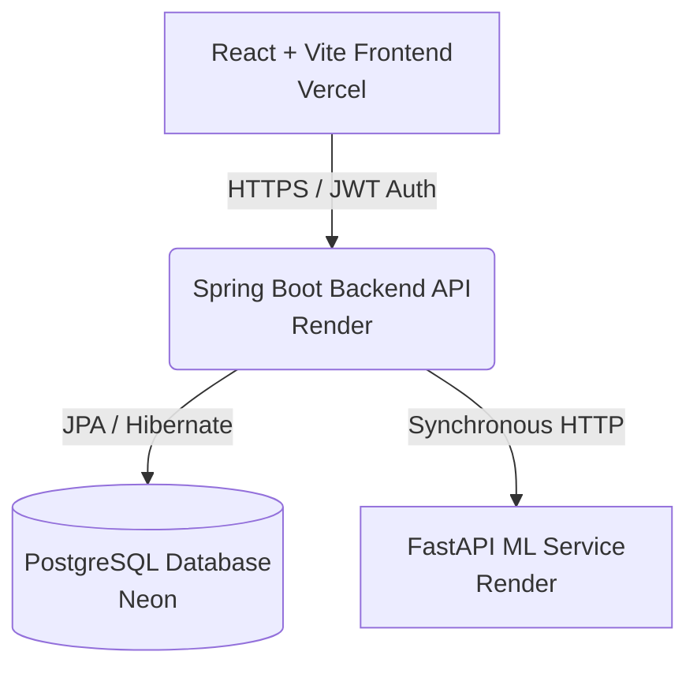

<div align="center">
  
  <h1>LuminaHealth AI Platform</h1>
  <p><strong>A Production-Grade Full-Stack Health Analytics SaaS</strong></p>
  
  [](https://luminahealth.vercel.app/)
  [](https://spring.io/)
  [](https://reactjs.org/)
  [](https://fastapi.tiangolo.com/)

</div>

<br>

> 🚀 **Note:** This is a FAANG-level portfolio project demonstrating microservice architecture, real-time analytics, machine learning integration, and responsive UI design.

## 🌟 Live Demonstration
The platform is deployed live across Vercel and Render cloud infrastructure.
- **Frontend Dashboard:** [https://luminahealth.vercel.app](https://luminahealth.vercel.app)
- **Backend API:** `https://health-backend.onrender.com/api`
- **ML Service API:** `https://health-ml.onrender.com/predict`

---

## 🏗️ System Architecture

LuminaHealth utilizes a decoupled microservice architecture:



### Components
1. **Frontend (React + Vite + Tailwind CSS):** A responsive, glassmorphism-styled dashboard containing real-time visual charts (Recharts) and an AI intelligence panel.
2. **Backend (Spring Boot 3 + Java 17):** Primary orchestrator handling JWT Authentication, CORS, API load balancing, and persisting health records.
3. **ML Service (FastAPI + Python):** Dedicated mathematical microservice computing 0.0-1.0 Health Risk levels using Deep Learning proxies.
4. **Database (Neon PostgreSQL):** Cloud-hosted relational persistence layer.

---

## ✨ Advanced Features

* **Real-time Analytics Polling**: The React application silently polls `GET /api/vitals` every 30 seconds to refresh the UI in true SaaS fashion.
* **AI Risk Gauges**: Mathematically calculates absolute risk levels, rendered into a stunning Consumer Health Score and gauge.
* **Smart Alerting Engine**: A customized algorithm parses raw user vitals and alerts the user if clinical thresholds (e.g. Glucose > 160) are breached.
* **Global Error Interceptors**: The Axios network layer safely catches 5xx crashes and network timeouts, injecting graphical fallback messages rendering the UI indestructible.
* **Secure JWT Auth**: Stateless session management with HTTP interceptors auto-appending Bearer tokens to all outbound requests.

---

## 💻 Local Development Setup

### Prerequisites
- Node.js (v18+)
- Java 17 & Maven
- Python 3.10+
- PostgreSQL locally installed

### 1. Start the ML Service (Port 8000)
```bash
cd ml-service
python -m venv venv
source venv/bin/activate  # Or venv\Scripts\activate on Windows
pip install -r requirements.txt
uvicorn app:app --host 0.0.0.0 --port 8000
```

### 2. Start the Spring Boot Backend (Port 8080)
```bash
cd health-monitoring-backend
# Ensure local postgres is running on port 5432 with database 'health_db'
./mvnw spring-boot:run
```

### 3. Start the React Frontend (Port 5173)
```bash
cd health-monitoring-frontend
npm install
npm run dev
```

Visit `http://localhost:5173` to view the application!

---

## ☁️ Production Deployment Guide

This repository is pre-configured with `render.yaml` for IaaS deployment.

1. **Database:** Provision a free PostgreSQL database on Neon.tech. Save the connection string.
2. **Web Services (Render.com):** Connect your GitHub repository to Render and use the `render.yaml` blueprint. It will automatically detect both the Spring Boot and FastAPI projects.
    - Set the `SPRING_DATASOURCE_URL` (and username/password) in the Render dashboard for the Spring Boot service.
3. **Frontend (Vercel.com):** Import the `health-monitoring-frontend` folder into Vercel.
    - Set the Environment Variable `VITE_API_BASE_URL` to your new deployed Spring Boot URL (e.g., `https://my-backend.onrender.com/api`).
    - Deploy!
